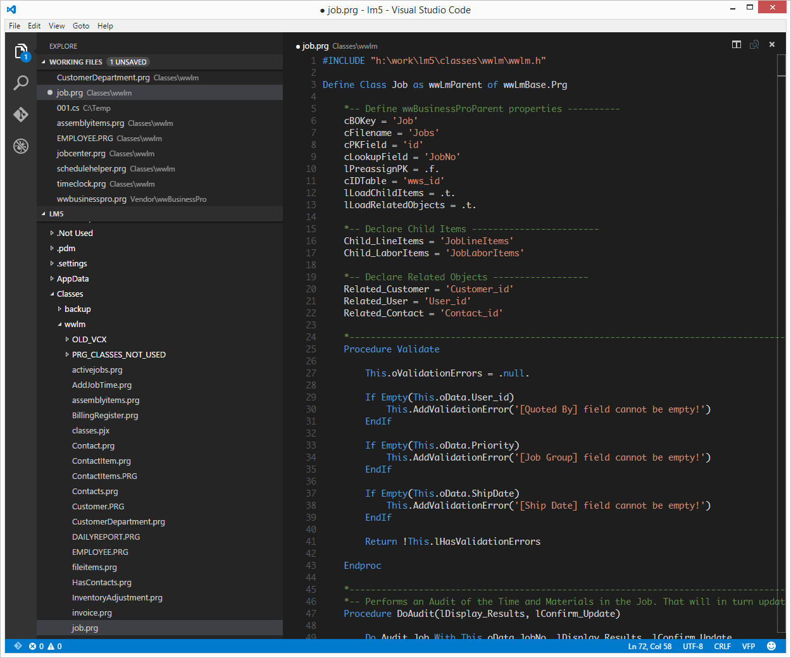

# README
## VSCode Syntax Highlighting and Snippets for Foxpro (VFP)

This extension adds generic syntax highlighting for foxpro (including function and class definition detection).

 

### How to Install

The easiest way to install this extension is to use the VSCode extensions sidebar and search for "foxpro". Click on the green "Install" button. (If you'd prefer to install from a VSIX file follow these instructions: https://code.visualstudio.com/docs/editor/extension-gallery#_install-from-a-vsix)

### Snippets
- *lnsel*: local select (declares a variable, stores the current area and then restores it)
- *docase*: CASE Statement (a case statement with two conditions and and otherwise)
- *prc*: PROCEDURE Declaration
- *dc*: DECLARE CLASS declaration (no external reference)
- *dco*: DECLARE CLASS declaration (using external file reference)
- *dcf*: DECLARE CLASS with direct instantiation (e.g. you can call `xxx = MyObjectFileName()` to get an instance of the object)
- *ifel*: IF/ELSE/ENDIF statement
- *ifend*: IF/ENDIF statement
- *iifs*: Simple IIF statement
- *ics*: Simple ICASE statement
- *tryc*: TRY/CATCH block
- *trycf*: TRY/CATCH/FINALLY block
- *adp*: ADDPROPERTY call
- *eo*: EMPTY object instantiation
- *newo*: NEWOBJECT call
- *fore*: FOR/ENDFOR loop
- *foralines*: use ALINES to split a string and interate each line with FOR/ENDFOR
- *bind*: BINDEVENT call

### Credits

Extension inspiration (and syntax highlighting file) from Matt Slay: https://github.com/mattslay/Visual-FoxPro-language-template-for-Visual-Studio-Code

Fox Icon provided by: by Freepik (https://www.freepik.com/) under the Creative Commons license

  
Internal snippet list -- these reference my company's internal libraries so probably not very useful for anyone else

  <ul>
<li> *fs* (select), *fso* (select into object),*fin* (insert),*fup* (update),*fdel* (delete)
<li> *multi* - TEXTAREA based multiprompt declaration
<li> *mptext*,*mpname*,*mpnum*,*mpdate*,*mplist*,*mpcheck*,*mplabel*,*mprange*,*mpnote*
<li> *open* (this.Open),*dopen* (this.Dao.Open)
<li> *dw* (.Where), *dwcomplete* (.Where full)
<li> *djoin* (.Join), *dfields* (.Fields), *dset* (.Set), *dsetobj* (.SetObject)
<li> *dinval* (.IntoValue), *dinobj* (.IntoObject), *dincurs* (.IntoCursor)
  </ul>

